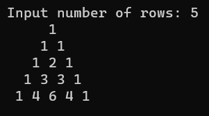

# Exp02-CSharpPattern

## Aim:
To write a C# program for a pascal's triangle
## Algorithm:

### Step1:
Get the number of rows from the user.
### Step2:
Use nested loop for printing the desired output.
### Step3:
Inside the outer loop create a loop for printing initial spaces.
### Step4:
Again create another loop for printing the values of the triangle.
### Step5:
Display the Pascal's triangle.
## Program:
```
using System;
namespace pattern
{
public class Pattern
{
    public static void Main()
    {
        int rows,c;

        Console.Write("Enter the number of rows:");
        rows=Convert.ToInt32(Console.ReadLine());
        for(int i=0;i<rows;i++)
        {
            for (int s=0;s<rows-i;s++)
            Console.Write(" ");

            for(int j=0;j<=i;j++)
            {
                if(i==1||j==1)
                c=1;
                else
                c=c*(i-j+1)/j;
                Console.Write("{0}",c);
            }
            Console.WriteLine(" ");
        }
    }
}
}
```
## Output:

## Result:
Thus the above C# program to print the Pascal's triangle is successsfully executed.